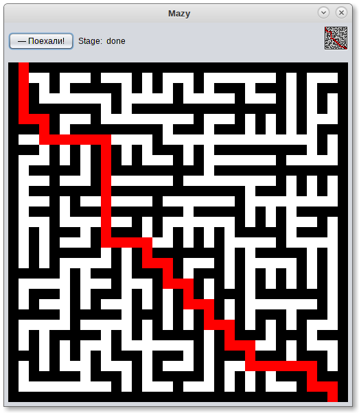

# Mazy



A program that demonstrates using randomized Prim's algorithm
for creating mazes and wave algorithm to find the path to exit.

## Build & run

This is a NetBeans project, so you should open it using NetBeans
and click "Run".

Alternatively, you can use Ant:

```sh
ant run
```

